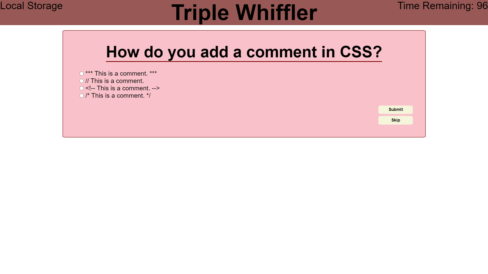

# Triple Whiffler
Hello world. Welcome to... *Triple Whiffler*.

This is a coding quiz programmed entirely from scratch. This quiz features:

* manipulation of the DOM through javascript to display different elements with dynamically updated values
* a timer that will start counting down when the test begins (incorrect answers to questions will also decrement the timer)
* high scores stored in local storage at the end of each quiz attempt

Here are two screenshots of the deployed application:

<a href="https://mikeyrod22.github.io/triple-whiffler/">Here is a link to the deployed site</a>